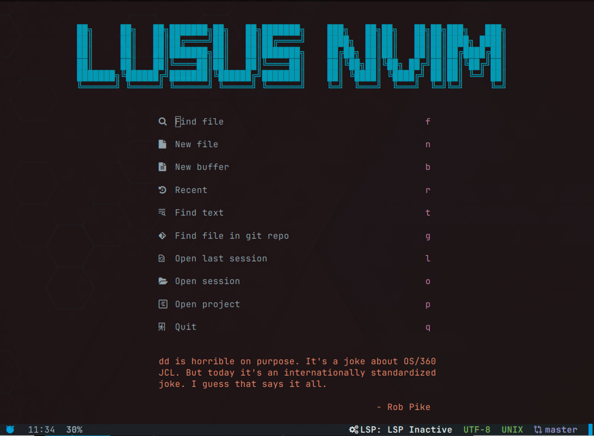
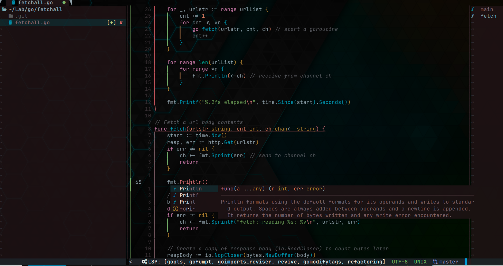
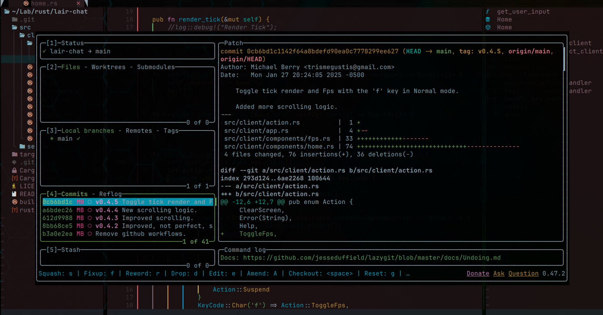

# LususNvim

## About

- LususNvim is a small yet fully featured IDE-like configuration for neovim.
- It's ready to use out of the box mut meant to be almost completely and very simply modified.
- No compromise on full IDE-like functionality is made while reamaing small and simple.
- It's goal is be a typical great personal configuration that also fulfills the role of distro.
- Full LSP feature support with autocompletion.

## Latest Release

v0.1.0

## Prerequisites

- Make sure you have installed the latest version of Neovim v0.10.0+.
- Have `git`, `make`, `pip`, `python`, `npm`, `node`, `cargo` and `ripgrep` installed on your system.
- Resolve `EACCESS` permissions with npm https://docs.npmjs.com/resolving-eacces-permissions-errors-when-installing-packages-globally

## Optional Prerequisites

- Install `lazygit`. This enables `<leader>gg` to launch lazygit for integrated and enhanced Git experience.
- Install `btop` for process management, `<leader>bt`.
- Install `gdu` for disk usage analytics, `<leader>gd`
- Install `tokei` for project lines of code information, `<leader>tk`.

## Installation

Direct installtion on a UNIX-like operating system.

    $ git clone https://github.com/berrym/LususNvim.git ~/.config/nvim

Recommended installation to a non default physical location.

    $ git clone https://github.com/berrym/LususNvim.git # into directory of user's choice
    $ ln -s ~/path/to/LususNvim ~/.config/nvim

Create a custom directory under the lua directory in the LususNvim root directory

    $ mkdir -pv ~/path/to/LususNvim/lua/custom
    $ cd ~/path/to/LususNvim/lua/custom
    $ cp ../example_custom_config.lua custom_config.LusuNvim

Create a git repo for your custom config directory, it's git ignored.

    $ git init
    $ git add custom_config.lua # edit file following commentary as desired
    $ git commit

Alternatively use my own custom config as a starting point.

    $ git clone https://github.com/berrym/LususNvim-Custom-Configuration.git # in desired location
    $ ln -s ~/path/to/LususNvim-Custom-Configuration ~/path/to/LususNvim/lua/custom

## Post installation

- After installation run nvim and let LususNvim download and configure it's requirements.
- This process can take several minutes so be patient.
- After the initial setup has finished close nvim then reopen it.

## Basic usage

- On startup you'll be greeted with a menu with many optiions.
  - What options appear depends on what features you have enabled or if you're in a git repo etc.
- LususNvim uses which-key so it will help guide the user on which keystrokes perform commands.
  - `?` will bring up buffer local keybindings if in a window other than the main, e.g. neotree.
- `<C-t>` which means hold down ctrl and press t will toggle a retractable terminal.
- Most commands are executed in Normal mode, and start by pressing the `<leader>` which is space.
- Neotree is a file explorer, when in Normal mode it can be accessed with the following:
  - `<leader>nl` opens neotree in a window on the left side.
  - `<leader>nr` opens neotree in a window on the right.
  - `<leader>nf` opens neotree in a floating window.
  - `<leader>nn` opens neotree like neovim's buitin file explorer netrw.
- Bufferline is a tabline for neovim buffers, `<leader>+b` prefixes buffer related commands:
  - `<leader>bb` switches to the previous buffer tab.
  - `<leader>bn` switches to the next buffer tab.
  - which-key will help you with all the available keybindings.
- Sessions can be created and restored:
  - `<leader>ss` saves the current session.
  - `<leader>so` will open a saved session.
  - On startup pressing `l` at the start menu will load your last session.
- As mentioned LSP and autocompletion come out of the box:
  - When performing a completion with an LSP server `<C-space>` will toggle documentation.
  - If diagnostics indicate error pressing `<leader>xx` will open up trouble for more verbose info.
- Lazy is the package manager it can be used with the command `:Lazy`
  - Extra plugins can easily be added and managed by editing the custom_config.
- Mason is the plugin used to manage LSP related tools:
  - `:Mason` opens the main ui for Mason
  - `:MasonInstall` will install extensions, `:MasonUninstall` does the opposite.
  - Configuration of Mason and LSP is easily managed by editing the custom_config.
- The command `:LususUpdate` can be used to update most of what get's installed.
- `:AstroTransparencyOn` and `:AstroTransparencyOff` can be used to toggle transparency.
- If you like controlling your session using the startup screen it can be opened with `<leader>;`
- There is much more but this represents a basic starting point.

## Copyright

Michael Berry 2025

## License

This project is licensed under the GNU General Public License version 3

See the file COPYING for more information

